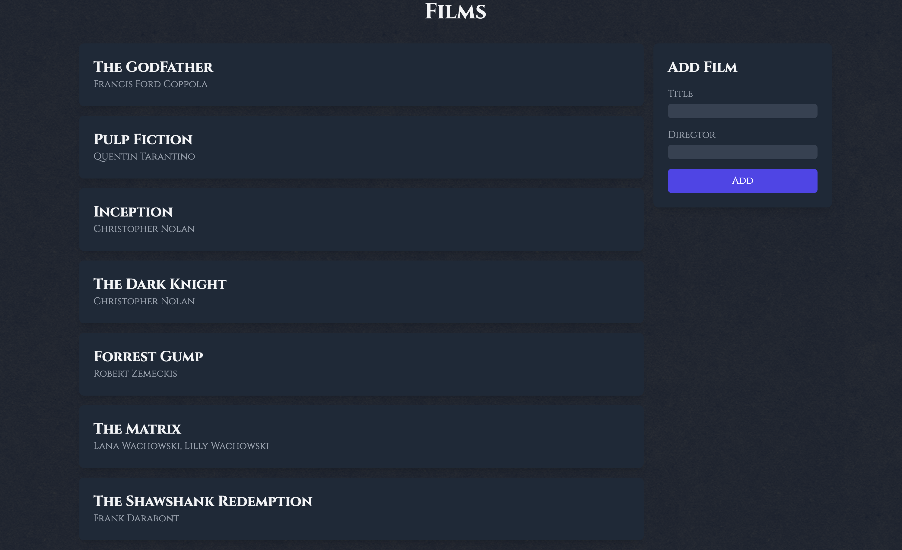

# Go HTMX Films List

This is a simple task management web application built with Go, HTMX, and Tailwind CSS. The application allows users to view a list of films and add new films to the list.

## Features

- Display a list of films with their titles and directors.
- Add new films using a form.
- Real-time updates with HTMX.
- Styled with Tailwind CSS for a modern look.
- Filmy theme with custom fonts and background.

## Screenshots


## Getting Started

### Prerequisites

- Go 1.16 or higher
- Internet connection to load external CSS and JS libraries

### Installation

1. Clone the repository:
    ```sh
    git clone https://github.com/thearjun/go-htmx-films.git
    cd go-htmx-task-management
    ```

2. Run the application:
    ```sh
    go run main.go
    ```

3. Open your web browser and navigate to `http://localhost:8080`.

## Usage

- View the list of films on the main page.
- Use the form on the right side to add new films. The list will update in real-time.

## Contributing

Contributions are welcome! Please open an issue or submit a pull request.

## License

This project is licensed under the MIT License.
